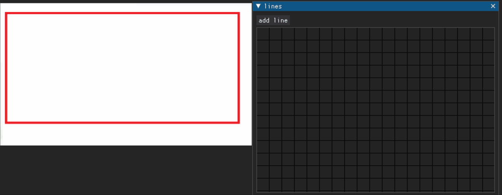

# Imagemeter

a tool for measuring lines on a photo

This tool lets you to draw lines, and connect them in a node editor.
* One line could have many children.
* If line is a child it cant have children.

You can input the size of the parent node and sizes for children will be calculated automatically.

## example
suppose you want to measure the height of the red rectangle. So you draw a
horizontal and a vertical line, connect them and input the length of a horizontal one.
